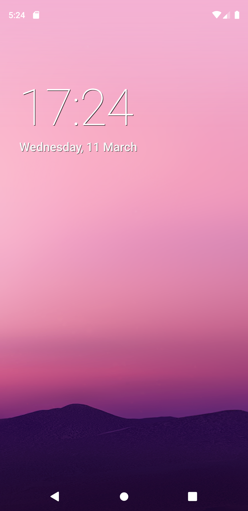
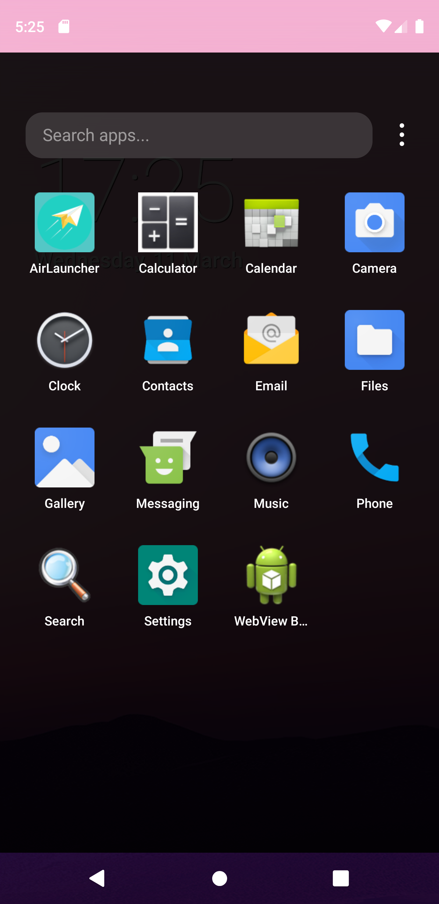
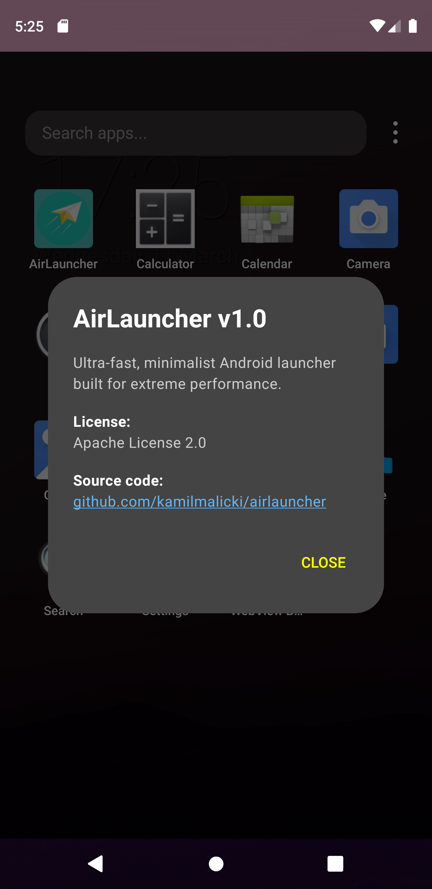

#  AirLauncher

**AirLauncher** is an ultra-fast, minimalist Android home screen (Launcher) built from scratch using Jetpack Compose. The project was created with extreme performance in mind, focusing on a minimal memory footprint (target: 10-30 MB RAM) and a buttery smooth 60 FPS experience on any device.

Empty RAM is wasted RAM, which is why AirLauncher ensures the system has more resources for your favorite apps rather than wasting them on a heavy home screen interface.

## ✨ Key Features

* **Uncompromising Performance:** Advanced UI rendering optimization techniques minimize CPU and GPU overhead.
* **Modern Design:** Elegant, clean interface featuring Hard Shadows and highly responsive, physics-based "Squish Effect" animations.
* **App Management:**
  * Lightning-fast app drawer triggered by an intuitive swipe gesture.
  * Hide pre-installed system apps (Bloatware) to keep your grid clean.
  * Direct app uninstallation right from the launcher.
* **Home Screen:** Pin your favorite app shortcuts directly to the main screen.
* **Dynamic Grid:** Seamless, instant switching between 4, 5, or 6 columns, persistently saved via `SharedPreferences`.
* **Live Search:** Smart, instant app filtering as you type, without dropping any animation frames.

---

## 📸 Screenshots

| Home Screen | App Drawer | Context Menu |
| :---: | :---: | :---: |
|  |  |  |

---

## 🛠️ Tech Stack & Architecture

AirLauncher isn't just about looks; it's about smart, efficient code. The core technologies include:

* **[Kotlin](https://kotlinlang.org/):** Primary programming language.
* **[Jetpack Compose](https://developer.android.com/jetpack/compose):** Fully declarative UI framework. `LazyVerticalGrid` replaces old, heavy XML views.
* **Coroutines & Dispatchers.IO:** Asynchronous package loading off the Main Thread, guaranteeing an instant cold start.
* **Lifecycle Events:** Smart app list refreshing (`ON_RESUME`), allowing the launcher to automatically update its state after background app installations or uninstalls.

### ⚡ Key Optimizations (Pro-Tips)
1. **GPU Offloading:** Removed `blurRadius` from font shadows (using Hard Shadows instead), drastically reducing GPU load during clock and widget rendering.
2. **List Keys & Types:** Implemented `key` and `contentType = { "app_icon" }` parameters in the grid component. This allows Compose to flawlessly recycle off-screen elements, maintaining a solid 60 FPS while fast-scrolling through hundreds of icons.
3. **RAM Management:** System app icons are decompressed and scaled on-the-fly to a 96x96 px format (`drawable.toBitmap()`), keeping the overall memory footprint incredibly low.

---

## 🚀 Installation & Build

To test the project locally:

1. check the release for the latest version and just download it
2. find the application and click on it in the file manager (permissions may be needed to install apps from unknown sources)
3. After installing, just run it
4. Set AirLauncher as your default home app in your device's settings.

---

## 📄 License

Distributed under the **Apache 2.0 License**. See the `LICENSE` file for more information.

---

*Built with a passion for minimalism and performance. If you like this project, please consider giving it a ⭐️ on GitHub!*

By Kamil Malicki
